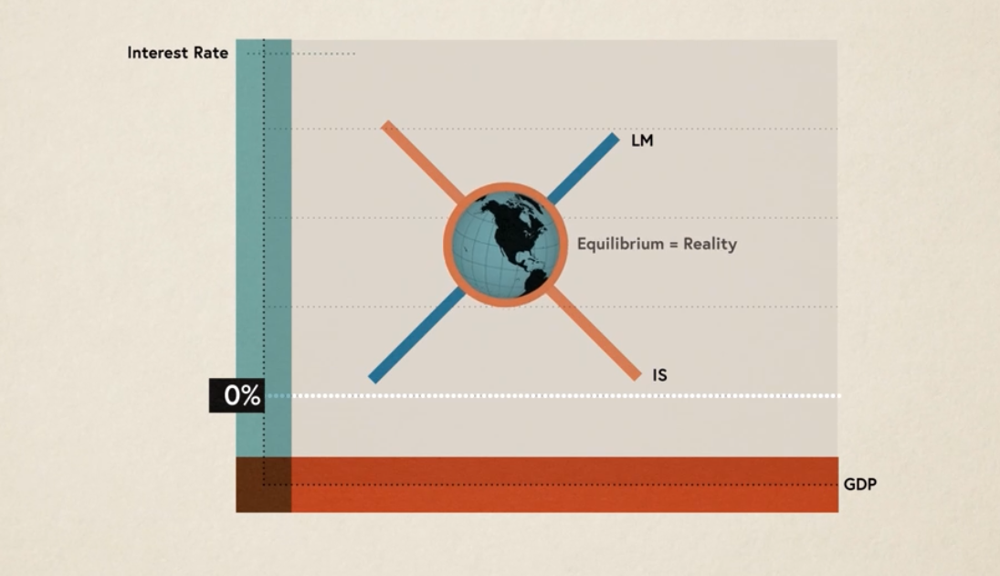

#### Economics and Society
          Paul Krugman

1. Paul believes that at its heart , economics is about people , how they earn their living and how they spend their income
2. The invisible hand : Adam smith’s notion that each individual’s economic self interest can contribute to the greater economic good under certain market conditions.
3. Economics makes us thinks better. 
4. Fundamental principles of economics 
   1. People respond to incentives 
   2. Each transaction has an equal give and take
5. Your sale is my purchase
6. You have to understand the past to improve your future
7. Wealth of a country doesn’t reside in gold or silver but in the production of goods , in short in productivity 
8. Productivity depends upon people doing different things
9. Wealth is about what you can do rather than holding on to what you have 
10. Say's it’s that supply creates its own demand, So in an economy, whenever there is a productive growth through supply , demand follows it. But this may not necessarily be true because there were times that the great depression happened, and there were times where recession kicked in, even though the countries economy was productive.
11. The more the interest rate given by banks the more people will try to economise on that.
12. LM (liquidity/ money preference) curve if the economy expands the interest increase. The higher is the interest rate the higher is GDP
14. IS curve 

