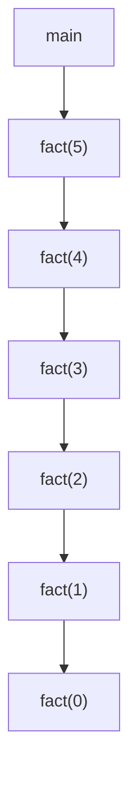
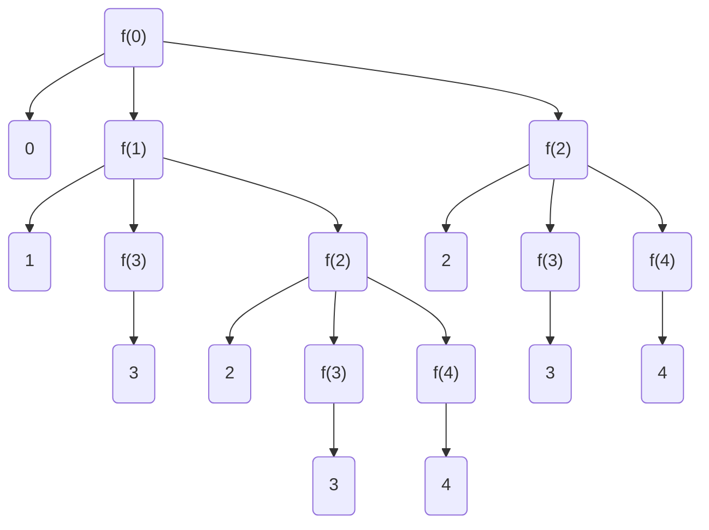
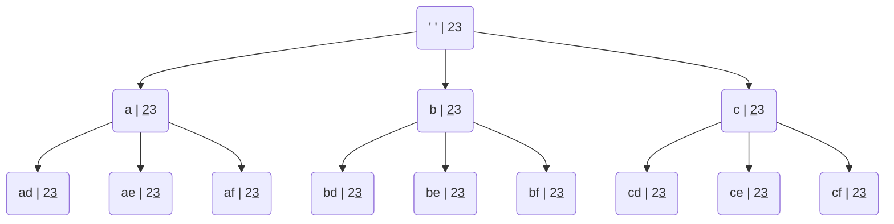
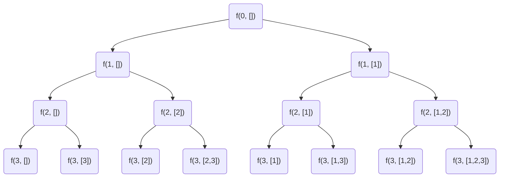

A process in which a function keeps calling itself is known as recursion and the corresponding function is called a recursive function. There are two important components to write a recursive function -

1. Recurrence relation - Break a larger problem to a smaller problem
2. Termination condition 

Control Flow 

```python
def fact(N:int):
	if N == 0: return 1
	return N * fact(N-1)
```




This is top to bottom (depth first) , the return happens in bottom to top fashion. The first function to return is the bottom (LIFO) . This is called stack.

Time complexity : O(n)      ->    n push operations and n pop operations

Space complexity : O(n)   ->    Recursion stack memory

This type of recursion is called single branch recursion.


```python
def func(x : int):
	print(x)
	if x>=3:
		return
	func(x+1)
	func(x+2)

if __name__ == "__main__":
	func(0)
```


The above snippet of code is for multi branch recursion

 **Recursion Tree Diagram**



Print numbers from 1 to N

```python
# Given N print 1 -> N using recursion
def f(x:int, n:int):
	if x > n:
		return
	print(x)
	f(x+1, n)

f(1, 10)
  

# with a single variable.
def f(n:int):
	if n == 0:
		return
	f(n-1)
	print(n)

f(10)
```


Given a m * n Grid  

Destination : (m-1, n-1)

Need to reach (0, 0) --> (m-1, n-1)

How many distinct paths ? Given Constraints : 1. 1 Unit right and 1 Unit Bottom


| (0, 0) | -   | -      |
| ------ | --- | ------ |
| -      | -   | (m, n) |

`Recurrence relation : CountPaths(i,j) = CountPaths(i,j+1) + CountPaths(i+1,j)`

`Termination condition : if i == m-1 or j == n-1  return 1`

```python
def CountPaths(i:int, j:int, m:int, n:int):
	if i == m -1 or j==n-1:
		return 1
	return CountPaths(i+1,j, m,n) + CountPaths(i, j+1, m, n)

CountPaths(0,0, 3,3)
```

Time Complexity  : O(2^ (m + n))  

The height of the binary tree is m + n (since every root to leaf path has  n right moves and m bottom moves , so total height is m  + n)

Now every node has two  nodes

total nodes = 1 + 2+ 4 .....2^(i-1) = 2^i  , Now i is nothing but height of the tree which is O(2^(m+n)) 


CountPaths Alternate solution  - I

```python
count =0
def helper(m:int, n:int):
	def countPaths(i:int, j:int):
		global count
		
		if i == m-1 or j == n-1:
			count=count+1
			return
			
		countPaths(i, j+1)
		countPaths(i+1, j)
	
	countPaths(0, 0)
	
	return count

helper(3, 3)
```


CountPaths Alternate solution  - II

Make the source fixed and travel from 0,0 to reach i, j

```python
def countPaths(i:int, j:int):
	if i == 0 or j == 0:
		return 1
	return countPaths(i-1, j) + countPaths(i, j-1)

print(countPaths(m-1, n-1))
```


**Letter combinations**

	2 - abc
	3 - def
	4 - ghi
	5 - jkl
	6 - mno
	7 - pqrs
	8 - tuv
	9 - wxyz
	

digits = '23'
output = [ad, ae, af, bd, be, bf, cd, ce, cf]



```python
digitMap = [['a', 'b', 'c'],
			['d', 'e', 'f'],
			['g', 'h', 'i'],
			['j', 'k', 'l'],
			['m', 'n', 'o'],
			['p', 'q', 'r', 's'],
			['t', 'u', 'v'],
			['w', 'x', 'y', 'z']]

def printAllCombs(tmp:str, digits:str, i:int, digitMap:list):

	if len(tmp) == len(digits):
		print(tmp)
		return

	for ch in digitMap[ord(digits[i]) - ord('2')]:
		printAllCombs(tmp+ch, digits, i+1, digitMap)

printAllCombs("", "23", 0,digitMap )
```


Use character list to avoid extra space, since the extra space is due to the string being created each time and its pass by value.

```python
digitMap = [['a', 'b', 'c'],
			['d', 'e', 'f'],
			['g', 'h', 'i'],
			['j', 'k', 'l'],
			['m', 'n', 'o'],
			['p', 'q', 'r', 's'],
			['t', 'u', 'v'],
			['w', 'x', 'y', 'z']]

def printAllCombs(tmp:list, digits:str, i:int, digitMap:list):

	if len(tmp) == len(digits):
		print(''.join(tmp))
		return

	for ch in digitMap[ord(digits[i]) - ord('2')]:
		tmp.append(ch)
		printAllCombs(tmp, digits, i+1, digitMap)
		tmp.pop()
		
temp = []
printAllCombs(temp, "23", 0,digitMap )
```

**Subsets**

Generate all the subsets of a given array

input = [1, 2, 3]

output = \[[1, 2, 3], [1,2], [1,3], [1], [2,3], [2], [3], []]

Think in the manner of inclusion exclusion



```python
def subsets(tmp:list, i:int, input_:list):
	if i == len(input_):
		print(tmp)
		return

	tmp.append(input_[i])
	subsets(tmp, i+1, input_)
	tmp.pop()
	subsets(tmp, i+1, input_)
	
temp = []
subsets(temp, 0, [1,2,3])
```


Time complexity : O($2^N$) : Since there will be $2^{N}$ leaf nodes (approximating the whole of the nodes

$$1 + 2 + 4 .....2^{N}   =  \frac{2^{N+1} -1}{(2-1)}$$

How to do the same thing with binary digits


