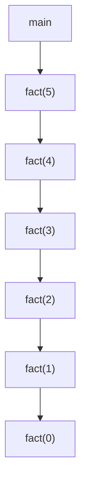
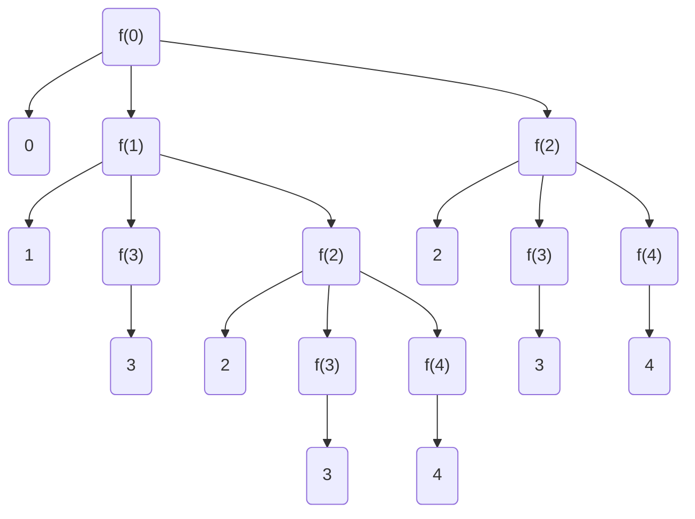

A process in which a function keeps calling itself is known as recursion and the corresponding function is called a recursive function. There are two important components to write a recursive function -

1. Recurrence relation - Break a larger problem to a smaller problem
2. Termination condition 

Control Flow 

```python
def fact(N:int):
	if N == 0: return 1
	return N * fact(N-1)
```




This is top to bottom (depth first) , the return happens in bottom to top fashion. The first function to return is the bottom (LIFO) . This is called stack.

Time complexity : O(n)      ->    n push operations and n pop operations

Space complexity : O(n)   ->    Recursion stack memory

This type of recursion is called single branch recursion.


```python
def func(x : int):
	print(x)
	if x>=3:
		return
	func(x+1)
	func(x+2)

if __name__ == "__main__":
	func(0)
```


The above snippet of code is for multi branch recursion

 **Recursion Tree Diagram**



Print numbers from 1 to N

```python
# Given N print 1 -> N using recursion
def f(x:int, n:int):
	if x > n:
		return
	print(x)
	f(x+1, n)

f(1, 10)
  

# with a single variable.
def f(n:int):
	if n == 0:
		return
	f(n-1)
	print(n)

f(10)
```


Given a m * n Grid  

Destination : (m-1, n-1)

Need to reach (0, 0) --> (m-1, n-1)

How many distinct paths ? Given Constraints : 1. 1 Unit right and 1 Unit Bottom


| (0, 0) | -   | -      |
| ------ | --- | ------ |
| -      | -   | -      |
| -      | -   | -      |
| -      | -   | (m, n) |


