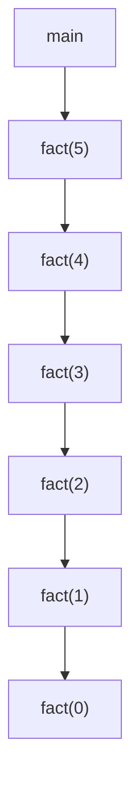

A process in which a function keeps calling itself is known as recursion and the corresponding function is called a recursive function. There are two important components to write a recursive function -

1. Recurrence relation - Break a larger problem to a smaller problem
2. Termination condition 

Control Flow 

```python
def fact(N:int):
	if N == 0: return 1
	return N * fact(N-1)
```




This is top to bottom (depth first) , the return happens in bottom to top fashion. The first function to return is the bottom (LIFO) . This is called stack.

Time complexity : O(n)

Space complexity : O(n)


