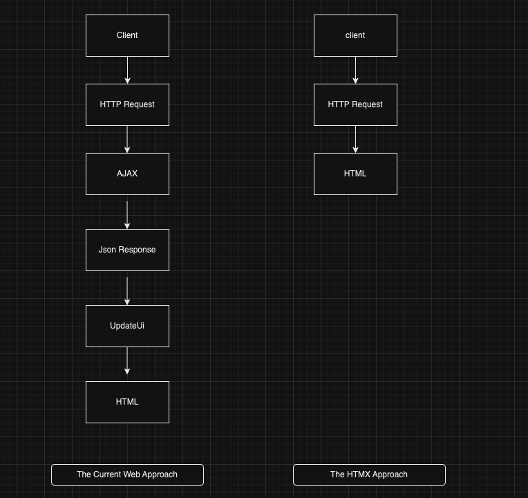

1. What is a hypermedia control ?

	Consider a simple anchor tag, embedded within a larger HTML document:
	
	```html
	<a href="https://hypermedia.systems/">
	  Hypermedia Systems
	</a>
	```
	
	An anchor tag consists of the tag itself, `<a></a>`, as well as the attributes and content within the tag. Of particular interest is the `href` attribute, which specifies a _hypertext reference_ to another document or document fragment. It is this attribute that makes the anchor tag a hypermedia control.

2. ```
────────────────────────┐      ┌─HTTP REQUEST────────────────┐
│ BROWSER              X │      │                             │
├────────────────────────┤      │ GET /                       │
│                        │      │ Host: hypermedia.systems    │
│ lorem ipsum dolor      │      └─────────────────────────────┘
│                        │
│ Hypermedia Systems ────┼───────────┐
│ ──────────────────     │           │
│ sit amet               │           │
│                        │           │
└────────────────────────┘           │
                              ┌──────▼──────┐
                              │   H T T P   │
                              │ S E R V E R │
                              └──────┬──────┘
┌────────────────────────┐           │
│ BROWSER              X │           │
├────────────────────────┤           │
│                        │           │
│ HYPERMEDIA SYSTEMS     ◀───────────┘
│                        │
│ The revolutionary      │      ┌─HTTP RESPONSE───────────────┐
│                        │      │                             │
│ ideas that empowered...│      │ 200 OK                      │
│                        │      │ ...                         │
└────────────────────────┘      │ <h1>Hypermedia Systems</h1> │
                                │ ...                         │```

3. In a typical web browser, this anchor tag would be interpreted to mean
   
   1. Show the text “Hypermedia Systems” in a manner indicating that it is clickable
    
   2. When the user clicks on that text, issue an HTTP `GET` request to the URL `https://hypermedia.systems/`
    
   3.  Take the HTML content in the body of the HTTP response to this request and replace the entire screen in the browser as a new document, updating the navigation bar to this new URL.
4. Form tags

Anchor tags provide _navigation_ between documents or resources, but don’t allow you to update those resources. That functionality falls to the form tag.

Here is a simple example of a form in HTML:

```html
<form action="/signup" method="post">
  <input type="text" name="email" placeholder="Enter Email To Sign Up">
  <button>Sign Up</button>
</form>
```

A simple form

Like an anchor tag, a form tag consists of the tag itself, `<form></form>`, combined with the attributes and content within the tag. Note that the form tag does not have an `href` attribute, but rather has an `action` attribute that specifies where to issue an HTTP request.

Furthermore, it also has a `method` attribute, which specifies exactly which HTTP “method” to use. In this example the form is asking the browser to issue a `POST` request.

In contrast with anchor tags, the content and tags _within_ a form can have an effect on the hypermedia interaction that the form makes with a server. The _values_ of `input` tags and other tags such as `select` tags will be included with the HTTP request when the form is submitted, as URL parameters in the case of a `GET` and as part of the request body in the case of a `POST`. This allows a form to include an arbitrary amount of information collected from a user in a request, unlike the anchor tag.

In a typical browser this form tag and its contents would be interpreted by the browser roughly as follows:

- Show a text input and a “Sign Up” button to the user
    
- When the user submits the form by clicking the “Sign Up” button or by hitting the enter key while the input element is focused, issue an HTTP `POST` request to the path `/signup` on the “current” server
    
- Take the HTML content in the body of the HTTP response body and replace the entire screen in the browser as a new document, updating the navigation bar to this new URL.
    

This mechanism allows the user to issue requests to _update the state_ of resources on the server. Note that despite this new type of request the communication between client and server is still done entirely with _hypermedia_.

It is the form tag that makes Hypermedia-Driven Applications possible.

```
┌────────────────────────┐      ┌─HTTP REQUEST────────────────┐
│ BROWSER              X │      │                             │
├────────────────────────┤      │ POST /                      │
│                        │      │ Host: hypermedia.systems    │
│ SIGN UP                │      │ ...                         │
│ ┌────────────────────┐ │      │ email=joe@example.com       │
│ │ joe@example.com    │ │      └─────────────────────────────┘
│ └────────────────────┘ │
│ ┌─────────┐        ────┼───────────┐
│ │ Sign up │            │           │
│ └─────────┘            │           │
└────────────────────────┘           │
                              ┌──────▼──────┐
                              │   H T T P   │
                              │ S E R V E R │
                              └──────┬──────┘
┌────────────────────────┐           │
│ BROWSER              X │           │
├────────────────────────┤           │
│                        │           │
│ THANK YOU FOR SIGNING  ◀───────────┘
│ UP                     │
│                        │      ┌─HTTP RESPONSE───────────────┐
│                        │      │                             │
│                        │      │ 201 Created                 │
│                        │      │ ...                         │
└────────────────────────┘      │ <h1>Thank you for signing   │
                                │ up</h1>                     │
                                └─────────────────────────────┘
```

5. consider the fact that these two hypermedia controls, anchors and forms, are the _only_ native ways for a user to interact with a server in plain HTML.
6. 
7. By adopting the hypermedia approach for these applications, you will save yourself a huge amount of client-side complexity that comes with adopting the Single Page Application approach: there is no need for client-side routing, for managing a client-side model, for hand-wiring in JavaScript logic, and so forth. The back button will “just work.” Deep linking will “just work.” You will be able to focus your efforts on your server, where your application is actually adding value.
8. A _hypermedia system_ consists of a number of components, including:

- A hypermedia, such as HTML.
    
- A network protocol, such as HTTP.
    
- A server that presents a hypermedia API responding to network requests with hypermedia responses.
    
- A client that properly interprets those responses.

9. 